# recon

Deterministic Jira task recon pipeline for Claude Code and Codex. Runs **before** any planning: decides whether a task is actionable, maps the code surface with evidence, and routes it into [decree](https://github.com/doruksahin/decree) — ending at a human approval gate, never at code. The same Agent Skills power both hosts; native manifests and UI metadata are generated and drift-checked.

[AdCreative-ai/recon-plugin](https://github.com/AdCreative-ai/recon-plugin) is
the canonical source and release repository. The public
[doruksahin/recon-plugin](https://github.com/doruksahin/recon-plugin) fork is a
personal portfolio and distribution mirror; changes and releases originate in
the organization repository.

```text
Recon Triage ATT-1234
  ├─ six blocker checks → triage.yaml
  ├─ BLOCKED → verified repro (if UI) → render-only dossier → n+4 comment + artifact zip → you approve → attach, then post → stop
  └─ READY  → auto-chains recon-discovery
               ├─ code surface + stable-ID Gherkin behavior contract
               ├─ routing stage: plain script (no governance) or the decree
               │  adapter skill (opt-in) → route/routing.yaml, handoff as data
               ├─ UI defects + UI edge cases → verified repro evidence before the brief
               └─ verified package → approval gate → verify answer → print handoff → stop
  on demand: Recon Report → self-contained HTML dossier; publishes only when the local host has a publisher
```

Your touchpoints per ticket: answer the gate, review the PR. That's it.

## Flow

Color legend — **blue**: mechanical rails (scripted/table-driven, no model freedom) · **yellow**: model judgment (must leave `file:line` / HTTP / quote evidence) · **red**: human gates (pipeline stops without you).

```mermaid
flowchart TD
    START(["Recon Triage TICKET"]) --> PRE["reconctl start triage<br>one root + host + surface + capability + Jira snapshot"]
    PRE --> S0["step 0 — fresh-workspace.sh<br>archive prior run → runs/&lt;ts&gt;/<br>stamp meta.yaml + copy index.md (once per run)"]
    S0 --> FETCH["fetch ticket — Jira GET v2<br>triage/ticket.json + aux-&lt;slug&gt;.json"]
    FETCH --> PART["partition comments<br>marker ~recon-triage~ = pipeline output, excluded<br>human comments = evidence"]
    PART --> CHECKS["six checks + cross-checks<br>one evidence line per claim"]
    CHECKS --> DISP{"disposition<br>triage/triage.yaml"}

    DISP -->|"BLOCKED / NEEDS_INFO"| BREPRO{"UI-related blockers?<br>(condition, not vibes)"}
    BREPRO -->|yes| BR["recon-repro — numbered steps + screenshots<br>verify-repro.sh clean before blocker questions"]
    BREPRO -->|no| RENDER
    BR --> RENDER["recon-report render-only<br>→ report/dossier.html<br>(no artifact publishing)"]
    RENDER --> DRAFT["draft comment — n+4 lines: header, one line<br>per blocker, links + reply + marker lines<br>verify-comment-shape.sh → triage/jira/comment.txt"]
    DRAFT --> PKG["package-artifacts.sh — zip the workspace<br>→ triage/jira/bundle-manifest.txt<br>(zip staged in a temp dir)"]
    PKG --> UIQ{{"human: post to Jira?<br>comment + 2 attachments<br>post / edit / don't post"}}
    UIQ -->|post| ATTACH["attach-artifacts.sh — replace recon-owned<br>attachments FIRST: delete stale, upload dossier<br>+ zip → triage/jira/attach-result.json"]
    ATTACH --> POST["THEN edit existing marker comment or create<br>→ triage/jira/post-result.json"]
    POST --> HALT1(["STOP — resume when answers arrive:<br>re-run recon-triage"])
    UIQ -->|"don't post"| HALT1

    DISP -->|READY| LOAD["recon-discovery<br>precondition: triage.yaml READY"]
    LOAD --> MAP["map code surface — file:line per claim<br>contract to reuse? test surface? edge cases?"]
    MAP --> GHERKIN["behavior contract → discovery/discovery.md<br>stable REQ-N + REG-N + OPEN-N scenarios"]
    GHERKIN --> GOV["governance ladder — env > config > probe<br>detection alone never opts in;<br>undecided → ONE question, answer persisted"]
    GOV --> GSEL{"governance?"}
    GSEL -->|none| RGEN["route-generic.sh (pure script)<br>0 scenarios → direct, else brief<br>→ route/routing.yaml (handoff as data)"]
    GSEL -->|"adapter (e.g. decree, opt-in)"| RDEC["recon-&lt;governance&gt; adapter skill<br>CLI checks + policy table<br>→ route/routing.yaml + aux-intent-check.txt"]

    RGEN --> RTRIG{"repro triggers (conditions, not vibes)<br>defect + visible UI + route not direct/no-doc?<br>OR OPEN scenario about visible UI?"}
    RDEC --> RTRIG
    RTRIG -->|yes| REPRO["recon-repro — fixed frontmatter + numbered steps<br>screenshot per state → repro/repro.md + exhibits/<br>failed repro = honest finding"]
    REPRO --> VREPRO["verify-repro.sh<br>non-symlink paths + step/exhibit + PNG container + provenance"]
    VREPRO --> BRIEFKIND{"brief_kind?"}
    RTRIG -->|no| BRIEFKIND
    BRIEFKIND -->|brief / problem statement| SPEC["discovery/spec-draft.md<br>exact scenario-ID parity · fixed sections<br>verified Manual verification when applicable"]
    BRIEFKIND -->|none| DPRE
    SPEC --> DPRE["verify-discovery.sh pre-gate<br>contract + route + brief + handoff parity"]

    DPRE --> GATE{{"human approval gate<br>OPEN decisions + approve / edit / reject"}}
    GATE -->|reject| GREJ["discovery/gate.yaml<br>exact OPEN-N keys + rejection reason"]
    GATE -->|approve| GAPP["gate.yaml + same-ID brief entry<br>exact OPEN-N keys + verbatim approved outcome"]
    GREJ --> DPOSTR["verify-discovery.sh post-gate"]
    DPOSTR --> REJ["STOP — verified rejection"]
    GAPP --> DPOSTA["verify-discovery.sh post-gate"]
    DPOSTA --> HAND["handoff printed VERBATIM from<br>route/routing.yaml (data, never recomposed)"]
    HAND --> HALT2(["STOP — implementation is a NEW session<br>from the routed host-neutral handoff"])

    HALT1 -.->|"on demand"| REPORT["recon-report — fixed template,<br>no new facts, screenshots embedded<br>→ report/dossier.html + private artifact"]
    HALT2 -.->|"on demand"| REPORT

    classDef rail fill:#dbeafe,stroke:#2563eb,color:#1e3a5f
    classDef judge fill:#fef9c3,stroke:#ca8a04,color:#713f12
    classDef human fill:#fee2e2,stroke:#dc2626,color:#7f1d1d
    classDef stop fill:#f3f4f6,stroke:#6b7280,color:#374151
    class PRE,S0,FETCH,PART,BREPRO,RENDER,PKG,ATTACH,POST,GOV,GSEL,RGEN,RDEC,RTRIG,VREPRO,BRIEFKIND,DPRE,DPOSTR,DPOSTA,HAND,REPORT rail
    class CHECKS,DISP,MAP,GHERKIN,DRAFT,BR,REPRO,SPEC judge
    class GREJ,GAPP judge
    class UIQ,GATE human
    class HALT1,HALT2,REJ stop
```



Full machine-readable spec of stages, invariants, artifacts, and triggers: [recon/docs/pipeline.md](recon/docs/pipeline.md).

## Install

### Claude Code

```
/plugin marketplace add AdCreative-ai/recon-plugin
/plugin install recon@recon-plugin
```

### Codex

```bash
codex plugin marketplace add AdCreative-ai/recon-plugin
codex plugin add recon@recon-plugin
```

Restart or start a new task after installation so the host discovers the new
skills. Invoke Recon Triage through the native skill UI (for example,
`$recon-triage ATT-1234` in Codex). Runtime detection, preflight,
capability levels, invocation rendering, and the authoritative host-package
parity/anti-drift policy are defined in
[recon/docs/hosts.md](recon/docs/hosts.md#package-parity-and-drift-prevention).

### Runtime scope

<!-- coherence:version -->Version `v0.21.0` executes on Claude Code and local Codex (app or CLI). Hosted
ChatGPT, Codex Cloud, MCP, centralized Jira authentication, shared remote state,
and remote publishing are intentionally outside this release rather than
partially supported.

## Prerequisites (each user, own machine)

1. **Your own Jira API token** in `~/.config/jira/env` (never share tokens):

   ```bash
   mkdir -p ~/.config/jira && cat > ~/.config/jira/env <<'EOF'
   JIRA_HOST=https://<your-org>.atlassian.net
   JIRA_EMAIL=<you>@<org>.com
   JIRA_API_TOKEN=<create at id.atlassian.com → Security → API tokens>
   EOF
   chmod 600 ~/.config/jira/env
   ```

2. **decree CLI** (optional) — enables the decree governance adapter. Without it (or with `governance=none` in `~/.config/recon/config`), routing runs on the generic rail and no decree vocabulary appears anywhere.
3. **gh CLI, logged in** — required by triage's conflict check. `reconctl.sh start triage` fails before workspace mutation when it is absent or unauthenticated.
4. **Workspace root** — optional. The backward-compatible default is
   `~/.claude/recon`; set `RECON_ROOT` to any absolute path to use a neutral or
   shared location. `recon/scripts/reconctl.sh root` prints the active value.

## Contributing to this repo

Read [CONTRIBUTING.md](CONTRIBUTING.md) first: `CHANGELOG.md` is generated from commit subjects, so the commit convention is not cosmetic — an unparseable subject is dropped from the release notes rather than rendered badly. It also covers what earns a breaking-change marker, and how to cut a release (`tools/release.sh`).

Enable the hooks once per clone — pre-commit runs the full local fail-closed
rail, while commit-msg blocks subjects that would never reach the changelog:

```bash
git config core.hooksPath .githooks
brew install lychee   # optional; without it, external URLs go unchecked
brew install uv       # required by the local commit rail
```

`tools/pre-commit-check.sh` is the one local entry point. It resolves the docs'
own file references against the working tree (backticked script names,
`../`-relative paths, and the `blob/master` links in
[docs/flow.html](docs/flow.html)), checks generated views and isolated
contracts, then validates Decree records. Run it any time with
`bash tools/pre-commit-check.sh`. Do not bypass it for normal work.

Native adapter files are generated, not hand-authored:

```bash
python3 tools/generate-adapters.py
python3 tools/generate-adapters.py --check
```

## Skills

| Skill | Stage | What it does |
|---|---|---|
| `recon-help` | any time | Orientation + setup doctor: the native entrypoint, every skill's own description, and shared preflight/handoff checks — all derived by `doctor.sh` |
| `recon-publish` | maintainer | Release + distribute behind one approval gate: `release.sh --yes`, native activation, mirror republish, smoke test |
| `recon-triage` | 0 | Preflight plus blocker verdict (READY/BLOCKED/NEEDS_INFO) from six mechanical checks; drafts owner-addressed questions; never plans |
| `recon-discovery` | 1 | Code surface with `file:line` evidence, stable-ID Gherkin contract, routed brief, and mechanically verified approval handoff |
| `recon-repro` | on demand | Live-reproduces observable behavior: verified numbered steps + one screenshot per state; honest about failed repros |
| `recon-report` | on demand / render-only | Always renders a fixed HTML dossier; publishes only when `publish_once` is available |
| `recon-state` | on demand / auto-refresh | Derives and renders the living state canvas; writes a stable URL only when `publish_stable_url` is available |
| `recon-decree` | adapter | Decree governance adapter — invoked by discovery only when governance resolves to `decree`; ALL decree vocabulary lives here |

## I/O contract

| Skill | Input | Writes (all under `$RECON_ROOT/<TICKET>/`) | External side effects |
|---|---|---|---|
| `recon-triage` | ticket ID/URL | root `meta.yaml` + `index.md` (step-0 script); `triage/{ticket.json, triage.yaml, aux-<slug>.json}`; on posting `triage/jira/{comment.txt, bundle-manifest.txt, post-result.json, attach-result.json}` (the zip is staged in a temp dir); prior runs archived to `runs/<timestamp>/` | at most one Jira comment (marker-signed) plus replacement of recon-owned `recon-*-<TICKET>.*` attachments — drafted/staged first, sent only after one explicit approval |
| `recon-discovery` | ticket ID (READY triage) | `discovery/{discovery.md, gate.yaml}` plus `spec-draft.md` unless `brief_kind: none` | none — verifies the package, quotes the handoff verbatim from `route/routing.yaml`, never executes it |
| routing stage | governance resolution | `route/routing.yaml` (route, rule trace, `handoff:` as data); adapter also writes `route/aux-intent-check.txt` | none — produced by `scripts/route-generic.sh` or the `recon-decree` adapter |
| `recon-repro` | ticket ID + claim | `repro/repro.md` + `repro/exhibits/*.png` | none (local only: boots the dev server, shows screenshots) |
| `recon-report` | ticket ID (run exists) | `report/dossier.html` | always renders; with `publish_once`, an on-demand run publishes one **private** artifact. Otherwise none — on the BLOCKED path, triage attaches the dossier behind its own gate. Never posts to Jira itself |

Nothing is ever pushed, committed, or posted anywhere without an explicit per-action approval. Jira gets at most one short comment per stage — edited on re-runs (detected by the `recon-triage` marker line), never appended — and attachments in the `recon-*-<TICKET>.*` namespace are replaced, never accumulated.

## Governance is opt-in (decree or nothing at all)

The developer-facing story is one sentence: **the first time recon meets a repo with a doc tool set up, it asks once how approved work should be handed off — the answer is saved and the question never fires again.** The question is phrased as outcomes, not config values — *"Write decree docs" / "Plain briefs" / "Follow each repo"* — every discovery report states the resolved handoff style in the same plain words, and you can change your answer anytime with `recon/scripts/set-governance.sh <none|decree|auto>`. The question's wording belongs to that script, not to a prompt, and the answer is recorded in your own words next to the value it was mapped to (`~/.config/recon/governance-exchanges.ndjson`) — so a standing choice that shapes every later handoff can be traced back to the exchange that set it.

Internals (for debugging, not onboarding): resolution is a ladder, most explicit wins — `RECON_GOVERNANCE` env (this run only) → `~/.config/recon/config` `governance=none|decree|auto` (the saved answer) → the probe (decree CLI + `decree.toml`). **Detection alone never opts you in**: an unanswered probe hit yields `undecided` and exactly the one question above. Developers who choose plain briefs (or never had decree) run the whole pipeline without seeing a single piece of decree vocabulary — all of it lives in the `recon-decree` adapter skill, and `lint-workspace.sh` greps every artifact to prove no leakage. Adapter convention for other governance systems: a sibling skill named `recon-<governance>` with the same contract.

## Deterministic re-runs

Every triage run starts with one `reconctl.sh start triage` snapshot; failure stops before workspace mutation. Step 0 then runs `recon/scripts/fresh-workspace.sh`, archives prior artifacts into `$RECON_ROOT/<TICKET>/runs/<timestamp>/`, and stamps `meta.yaml` with plugin version, start time, starting host, and starting surface. Every later ledger event re-detects its current host and surface, so cross-harness continuation is auditable rather than frozen to startup. The step runs exactly once per run: a re-invocation within 30 minutes is refused (`SKIPPED`). Each skill writes only inside its own stage directory; `scripts/lint-workspace.sh` verifies the artifact registry. No skill may read `runs/`; inputs are the live Jira API, git, and `gh`. Recon-authored Jira comments are excluded from evidence checks, and undeclared artifacts are contract violations.

## Principles baked in

- Evidence per claim (`file:line` or command output) — no claim without it.
- No prose unknowns: every unknown is resolved by a command or becomes a question with a named owner.
- Human-facing questions are concrete: numbered repro steps, real entity names, user-observable outcomes; internal identifiers banned.
- Model-authored evidence becomes consumable only after its package verifier passes; stable IDs prevent the contract, brief, and gate from silently drifting apart.
- Recon describes, the routing table decides, the human confirms, decree executes.
- Every visible-UI defect ships with a reproduce-the-bug path: discovery invokes recon-repro for the primary scenario (mechanical trigger: defect + visible UI + not no-doc), and `spec-draft.md` always carries a Manual verification section — start state, numbered steps, BEFORE/AFTER — so the implementer never re-derives how to reach the surface.
