# recon

Deterministic Jira task recon pipeline for Claude Code. Runs **before** any planning: decides whether a task is actionable, maps the code surface with evidence, and routes it into [decree](https://github.com/doruksahin/decree) — ending at a human approval gate, never at code.

```
/recon:recon-triage ATT-1234
  ├─ six blocker checks → triage.yaml
  ├─ BLOCKED → drafts PM questions (+ screenshots when UI-related) → you post → stop
  └─ READY  → auto-chains recon-discovery
               ├─ code surface + Gherkin contract + decree intent-check
               ├─ routing: no-doc | amend-spec | new-spec | prd-chain | escalate
               ├─ UI defects + UI edge cases → recon-repro captures repro steps + screenshots
               └─ approval gate → prints decree handoff commands → stop
```

Your touchpoints per ticket: answer the gate, review the PR. That's it.

## Flow

Color legend — **blue**: mechanical rails (scripted/table-driven, no model freedom) · **yellow**: model judgment (must leave `file:line` / HTTP / quote evidence) · **red**: human gates (pipeline stops without you).

```mermaid
flowchart TD
    START(["/recon:recon-triage TICKET"]) --> S0["step 0 — fresh-workspace.sh<br>archive prior run → runs/&lt;ts&gt;/<br>stamp meta.yaml (once per run)"]
    S0 --> FETCH["fetch ticket — Jira GET v2<br>ticket.json + aux-&lt;slug&gt;.json"]
    FETCH --> PART["partition comments<br>marker ~recon-triage~ = pipeline output, excluded<br>human comments = evidence"]
    PART --> CHECKS["six checks + cross-checks<br>one evidence line per claim"]
    CHECKS --> DISP{"disposition<br>triage.yaml"}

    DISP -->|"BLOCKED / NEEDS_INFO"| DRAFT["draft comment ≤15 lines<br>owner-addressed questions, marker-signed<br>→ comment.txt"]
    DRAFT --> UIQ{{"human: post / edit / don't post"}}
    UIQ -->|post| POST["edit existing marker comment or create<br>→ post-result.json, attach-result.json"]
    POST --> HALT1(["STOP — resume when answers arrive:<br>re-run recon-triage"])
    UIQ -->|"don't post"| HALT1

    DISP -->|READY| LOAD["recon-discovery<br>precondition: triage.yaml READY"]
    LOAD --> MAP["map code surface — file:line per claim<br>contract to reuse? test surface? edge cases?"]
    MAP --> GHERKIN["behavior contract → discovery.md<br>required + regression + OPEN scenarios"]
    GHERKIN --> DECREE["decree index rebuild → why → intent-check"]
    DECREE --> ROUTE["routing policy table, first match wins<br>→ routing.yaml: matched_rule + rules_not_matched"]

    ROUTE --> RTRIG{"repro triggers (conditions, not vibes)<br>defect + visible UI + route ≠ no-doc?<br>OR OPEN scenario about visible UI?"}
    RTRIG -->|yes| REPRO["recon-repro — dev server (mock mode)<br>stated start state, numbered steps,<br>screenshot per state → repro.md<br>failed repro = honest finding"]
    RTRIG -->|no| SPEC
    REPRO --> SPEC["spec-draft.md<br>ACs 1:1 from Gherkin · tech design ≤10 lines<br>guardrails · Manual verification (from repro.md)"]

    SPEC --> GATE{{"human approval gate<br>OPEN decisions + approve / edit / reject"}}
    GATE -->|reject| REJ["gate.rejected recorded → STOP"]
    GATE -->|approve| HAND["gate: block written to routing.yaml<br>print handoff (never execute):<br>no-doc · amend-spec · new-spec · prd-chain"]
    HAND --> HALT2(["STOP — implementation is a NEW session<br>via /decree:ddd from the routed phase"])

    classDef rail fill:#dbeafe,stroke:#2563eb,color:#1e3a5f
    classDef judge fill:#fef9c3,stroke:#ca8a04,color:#713f12
    classDef human fill:#fee2e2,stroke:#dc2626,color:#7f1d1d
    classDef stop fill:#f3f4f6,stroke:#6b7280,color:#374151
    class S0,FETCH,PART,POST,DECREE,ROUTE,RTRIG,HAND rail
    class CHECKS,DISP,MAP,GHERKIN,DRAFT,REPRO,SPEC judge
    class UIQ,GATE human
    class HALT1,HALT2,REJ stop
```



Full machine-readable spec of stages, invariants, artifacts, and triggers: [recon/docs/pipeline.md](recon/docs/pipeline.md).

## Install

```
/plugin marketplace add doruksahin/recon-plugin
/plugin install recon@recon-plugin
```

## Prerequisites (each user, own machine)

1. **Your own Jira API token** in `~/.config/jira/env` (never share tokens):

   ```bash
   mkdir -p ~/.config/jira && cat > ~/.config/jira/env <<'EOF'
   JIRA_HOST=https://<your-org>.atlassian.net
   JIRA_EMAIL=<you>@<org>.com
   JIRA_API_TOKEN=<create at id.atlassian.com → Security → API tokens>
   EOF
   chmod 600 ~/.config/jira/env
   ```

2. **decree CLI** (optional but recommended) — powers the governance routing (`decree intent-check`). Without it, discovery records `governance: none` and routes without rule 1.
3. **gh CLI, logged in** — used by triage's conflict check (open PR scan). Degrades gracefully if absent.

## Skills

| Skill | Stage | What it does |
|---|---|---|
| `/recon:recon-triage` | 0 | Blocker verdict (READY/BLOCKED/NEEDS_INFO) from six mechanical checks; drafts owner-addressed questions; never plans |
| `/recon:recon-discovery` | 1 | Code surface with `file:line` evidence, Gherkin behavior contract, deterministic decree routing, approval gate |
| `/recon:recon-repro` | on demand | Live-reproduces observable behavior: numbered steps + one screenshot per state; honest about failed repros |

## I/O contract

| Skill | Input | Writes (all under `~/.claude/recon/<TICKET>/`) | External side effects |
|---|---|---|---|
| `recon-triage` | ticket ID/URL | `meta.yaml`, `ticket.json`, `triage.yaml`, auxiliary `aux-<slug>.json` fetches; on posting: `comment.txt`, `post-result.json`, `attach-result.json`; prior-run artifacts archived to `runs/<timestamp>/` | at most one Jira comment (marker-signed) — drafted first, sent only after your explicit approval |
| `recon-discovery` | ticket ID (READY triage) | `discovery.md`, `routing.yaml`, `spec-draft.md` | none — prints decree handoff commands, never executes them |
| `recon-repro` | ticket ID + claim | `repro.md` + `repro-*.png` | none (local only: boots the dev server, shows screenshots) |

Nothing is ever pushed, committed, or posted anywhere without an explicit per-action approval. Jira gets at most one short comment per stage — edited on re-runs (detected by the `recon-triage` marker line), never appended.

## Deterministic re-runs

Every triage run starts from a clean workspace: step 0 runs `recon-triage/scripts/fresh-workspace.sh`, which archives all prior artifacts (dotfiles included) into `~/.claude/recon/<TICKET>/runs/<timestamp>/` and stamps the new run with `meta.yaml` (plugin version + start time). The step lives in a script — not inline in the skill — so it executes byte-identically every run, and it runs exactly once per run: a re-invocation within 30 minutes is refused (`SKIPPED`) so a run can never archive its own in-progress artifacts. No skill may read anything under `runs/` — the only inputs are the live Jira API, git, and `gh`. Recon's own Jira comments carry a marker line and are excluded from all evidence checks, so a run is never influenced by the output of a previous (possibly older-versioned) run. Every file a run may write is declared in the I/O contract above — an undeclared artifact is a contract violation.

## Principles baked in

- Evidence per claim (`file:line` or command output) — no claim without it.
- No prose unknowns: every unknown is resolved by a command or becomes a question with a named owner.
- Human-facing questions are concrete: numbered repro steps, real entity names, user-observable outcomes; internal identifiers banned.
- Recon describes, the routing table decides, the human confirms, decree executes.
- Every visible-UI defect ships with a reproduce-the-bug path: discovery invokes recon-repro for the primary scenario (mechanical trigger: defect + visible UI + not no-doc), and `spec-draft.md` always carries a Manual verification section — start state, numbered steps, BEFORE/AFTER — so the implementer never re-derives how to reach the surface.
