# recon

Deterministic Jira task recon pipeline for Claude Code. Runs **before** any planning: decides whether a task is actionable, maps the code surface with evidence, and routes it into [decree](https://github.com/doruksahin/decree) — ending at a human approval gate, never at code.

```
/recon:recon-triage ATT-1234
  ├─ six blocker checks → triage.yaml
  ├─ BLOCKED → repro (if UI) → render-only dossier → n+4 comment + artifact zip → you approve → attach, then post → stop
  └─ READY  → auto-chains recon-discovery
               ├─ code surface + Gherkin behavior contract
               ├─ routing stage: plain script (no governance) or the decree
               │  adapter skill (opt-in) → route/routing.yaml, handoff as data
               ├─ UI defects + UI edge cases → recon-repro captures repro steps + screenshots
               └─ approval gate → prints decree handoff commands → stop
  on demand: /recon:recon-report → self-contained HTML dossier (private artifact); the BLOCKED path renders it automatically, attachment-only
```

Your touchpoints per ticket: answer the gate, review the PR. That's it.

## Flow

Color legend — **blue**: mechanical rails (scripted/table-driven, no model freedom) · **yellow**: model judgment (must leave `file:line` / HTTP / quote evidence) · **red**: human gates (pipeline stops without you).

```mermaid
flowchart TD
    START(["/recon:recon-triage TICKET"]) --> S0["step 0 — fresh-workspace.sh<br>archive prior run → runs/&lt;ts&gt;/<br>stamp meta.yaml + copy index.md (once per run)"]
    S0 --> FETCH["fetch ticket — Jira GET v2<br>triage/ticket.json + aux-&lt;slug&gt;.json"]
    FETCH --> PART["partition comments<br>marker ~recon-triage~ = pipeline output, excluded<br>human comments = evidence"]
    PART --> CHECKS["six checks + cross-checks<br>one evidence line per claim"]
    CHECKS --> DISP{"disposition<br>triage/triage.yaml"}

    DISP -->|"BLOCKED / NEEDS_INFO"| BREPRO{"UI-related blockers?<br>(condition, not vibes)"}
    BREPRO -->|yes| BR["recon-repro — numbered steps +<br>screenshots for the blocker questions"]
    BREPRO -->|no| RENDER
    BR --> RENDER["recon-report render-only<br>→ report/dossier.html<br>(no artifact publishing)"]
    RENDER --> DRAFT["draft comment — n+4 lines: header, one line<br>per blocker, links + reply + marker lines<br>verify-comment-shape.sh → triage/jira/comment.txt"]
    DRAFT --> PKG["package-artifacts.sh — zip the workspace<br>→ triage/jira/bundle-manifest.txt<br>(zip staged in a temp dir)"]
    PKG --> UIQ{{"human: post to Jira?<br>comment + 2 attachments<br>post / edit / don't post"}}
    UIQ -->|post| ATTACH["attach-artifacts.sh — replace recon-owned<br>attachments FIRST: delete stale, upload dossier<br>+ zip → triage/jira/attach-result.json"]
    ATTACH --> POST["THEN edit existing marker comment or create<br>→ triage/jira/post-result.json"]
    POST --> HALT1(["STOP — resume when answers arrive:<br>re-run recon-triage"])
    UIQ -->|"don't post"| HALT1

    DISP -->|READY| LOAD["recon-discovery<br>precondition: triage.yaml READY"]
    LOAD --> MAP["map code surface — file:line per claim<br>contract to reuse? test surface? edge cases?"]
    MAP --> GHERKIN["behavior contract → discovery/discovery.md<br>required + regression + OPEN scenarios"]
    GHERKIN --> GOV["governance ladder — env > config > probe<br>detection alone never opts in;<br>undecided → ONE question, answer persisted"]
    GOV --> GSEL{"governance?"}
    GSEL -->|none| RGEN["route-generic.sh (pure script)<br>0 scenarios → direct, else brief<br>→ route/routing.yaml (handoff as data)"]
    GSEL -->|"adapter (e.g. decree, opt-in)"| RDEC["recon-&lt;governance&gt; adapter skill<br>CLI checks + policy table<br>→ route/routing.yaml + aux-intent-check.txt"]

    RGEN --> RTRIG{"repro triggers (conditions, not vibes)<br>defect + visible UI + route not direct/no-doc?<br>OR OPEN scenario about visible UI?"}
    RDEC --> RTRIG
    RTRIG -->|yes| REPRO["recon-repro — dev server (mock mode)<br>stated start state, numbered steps,<br>screenshot per state → repro/repro.md + exhibits/<br>failed repro = honest finding"]
    RTRIG -->|no| SPEC
    REPRO --> SPEC["discovery/spec-draft.md<br>ACs 1:1 from Gherkin · tech design ≤10 lines<br>guardrails · Manual verification (from repro/repro.md)"]

    SPEC --> GATE{{"human approval gate<br>OPEN decisions + approve / edit / reject"}}
    GATE -->|reject| REJ["discovery/gate.yaml records the reject → STOP"]
    GATE -->|approve| HAND["gate recorded in discovery/gate.yaml<br>handoff printed VERBATIM from<br>route/routing.yaml (data, never recomposed)"]
    HAND --> HALT2(["STOP — implementation is a NEW session<br>via /decree:ddd from the routed phase"])

    HALT1 -.->|"on demand"| REPORT["recon-report — fixed template,<br>no new facts, screenshots embedded<br>→ report/dossier.html + private artifact"]
    HALT2 -.->|"on demand"| REPORT

    classDef rail fill:#dbeafe,stroke:#2563eb,color:#1e3a5f
    classDef judge fill:#fef9c3,stroke:#ca8a04,color:#713f12
    classDef human fill:#fee2e2,stroke:#dc2626,color:#7f1d1d
    classDef stop fill:#f3f4f6,stroke:#6b7280,color:#374151
    class S0,FETCH,PART,BREPRO,RENDER,PKG,ATTACH,POST,GOV,GSEL,RGEN,RDEC,RTRIG,HAND,REPORT rail
    class CHECKS,DISP,MAP,GHERKIN,DRAFT,BR,REPRO,SPEC judge
    class UIQ,GATE human
    class HALT1,HALT2,REJ stop
```



Full machine-readable spec of stages, invariants, artifacts, and triggers: [recon/docs/pipeline.md](recon/docs/pipeline.md).

## Install

```
/plugin marketplace add doruksahin/recon-plugin
/plugin install recon@recon-plugin
```

## Prerequisites (each user, own machine)

1. **Your own Jira API token** in `~/.config/jira/env` (never share tokens):

   ```bash
   mkdir -p ~/.config/jira && cat > ~/.config/jira/env <<'EOF'
   JIRA_HOST=https://<your-org>.atlassian.net
   JIRA_EMAIL=<you>@<org>.com
   JIRA_API_TOKEN=<create at id.atlassian.com → Security → API tokens>
   EOF
   chmod 600 ~/.config/jira/env
   ```

2. **decree CLI** (optional) — enables the decree governance adapter. Without it (or with `governance=none` in `~/.config/recon/config`), routing runs on the generic rail and no decree vocabulary appears anywhere.
3. **gh CLI, logged in** — used by triage's conflict check (open PR scan). Degrades gracefully if absent.

## Contributing to this repo

Read [CONTRIBUTING.md](CONTRIBUTING.md) first: `CHANGELOG.md` is generated from commit subjects, so the commit convention is not cosmetic — an unparseable subject is dropped from the release notes rather than rendered badly. It also covers what earns a breaking-change marker, and how to cut a release (`tools/release.sh`).

Enable the hooks once per clone — they run on every commit, blocking docs that point at files which no longer exist and subjects that would never reach the changelog:

```bash
git config core.hooksPath .githooks
brew install lychee   # optional; without it, external URLs go unchecked
brew install uv       # optional; without it, commit messages go unchecked
```

`tools/check-links.sh` resolves the docs' own file references against the working tree (backticked script names, `../`-relative paths, and the `blob/master` links in [docs/flow.html](docs/flow.html)), then hands real links to [lychee](https://github.com/lycheeverse/lychee). Rename a script and every doc still naming it fails the commit. Run it any time with `bash tools/check-links.sh`; bypass once with `git commit --no-verify`.

## Skills

| Skill | Stage | What it does |
|---|---|---|
| `/recon:recon-help` | any time | Orientation + setup doctor: the one command, every skill's own description, and live checks (Jira credentials, handoff style) — all derived by `doctor.sh` at run time, never restated from memory |
| `/recon:recon-publish` | maintainer | Release + distribute behind one approval gate: `release.sh --yes` (bump, tag, push, GitHub Release), cache activation + clone sync via `activate-plugin.sh`, republish of changed artifact mirrors, smoke test |
| `/recon:recon-triage` | 0 | Blocker verdict (READY/BLOCKED/NEEDS_INFO) from six mechanical checks; drafts owner-addressed questions; never plans |
| `/recon:recon-discovery` | 1 | Code surface with `file:line` evidence, Gherkin behavior contract, routing via the governance adapter or generic rail, approval gate |
| `/recon:recon-repro` | on demand | Live-reproduces observable behavior: numbered steps + one screenshot per state; honest about failed repros |
| `/recon:recon-report` | on demand / render-only | Renders the run's artifacts into a designed HTML dossier (fixed template, no new facts) — published as a private artifact on demand, or rendered render-only for triage to attach to the ticket on the BLOCKED/NEEDS_INFO path |
| `/recon:recon-state` | on demand / auto-refresh | The ticket's living state canvas: stop + node statuses derived from artifact presence by `derive-state.sh`, rendered by `render-state-canvas.sh`, republished to one stable private URL at every STOP/gate; timeline from the ticket ledger |
| `recon-decree` | adapter | Decree governance adapter — invoked by discovery only when governance resolves to `decree`; ALL decree vocabulary lives here |

## I/O contract

| Skill | Input | Writes (all under `~/.claude/recon/<TICKET>/`) | External side effects |
|---|---|---|---|
| `recon-triage` | ticket ID/URL | root `meta.yaml` + `index.md` (step-0 script); `triage/{ticket.json, triage.yaml, aux-<slug>.json}`; on posting `triage/jira/{comment.txt, bundle-manifest.txt, post-result.json, attach-result.json}` (the zip is staged in a temp dir); prior runs archived to `runs/<timestamp>/` | at most one Jira comment (marker-signed) plus replacement of recon-owned `recon-*-<TICKET>.*` attachments — drafted/staged first, sent only after one explicit approval |
| `recon-discovery` | ticket ID (READY triage) | `discovery/{discovery.md, spec-draft.md, gate.yaml}` | none — quotes the handoff verbatim from `route/routing.yaml`, never executes it |
| routing stage | governance resolution | `route/routing.yaml` (route, rule trace, `handoff:` as data); adapter also writes `route/aux-intent-check.txt` | none — produced by `scripts/route-generic.sh` or the `recon-decree` adapter |
| `recon-repro` | ticket ID + claim | `repro/repro.md` + `repro/exhibits/*.png` | none (local only: boots the dev server, shows screenshots) |
| `recon-report` | ticket ID (run exists) | `report/dossier.html` | on demand: publishes one **private** artifact (dossier URL); render-only (BLOCKED path): none — triage attaches the dossier behind its own gate. Never posts to Jira itself |

Nothing is ever pushed, committed, or posted anywhere without an explicit per-action approval. Jira gets at most one short comment per stage — edited on re-runs (detected by the `recon-triage` marker line), never appended — and attachments in the `recon-*-<TICKET>.*` namespace are replaced, never accumulated.

## Governance is opt-in (decree or nothing at all)

The developer-facing story is one sentence: **the first time recon meets a repo with a doc tool set up, it asks once how approved work should be handed off — the answer is saved and the question never fires again.** The question is phrased as outcomes, not config values — *"Write decree docs" / "Plain briefs" / "Follow each repo"* — every discovery report states the resolved handoff style in the same plain words, and you can change your answer anytime with `recon/scripts/set-governance.sh <none|decree|auto>`.

Internals (for debugging, not onboarding): resolution is a ladder, most explicit wins — `RECON_GOVERNANCE` env (this run only) → `~/.config/recon/config` `governance=none|decree|auto` (the saved answer) → the probe (decree CLI + `decree.toml`). **Detection alone never opts you in**: an unanswered probe hit yields `undecided` and exactly the one question above. Developers who choose plain briefs (or never had decree) run the whole pipeline without seeing a single piece of decree vocabulary — all of it lives in the `recon-decree` adapter skill, and `lint-workspace.sh` greps every artifact to prove no leakage. Adapter convention for other governance systems: a sibling skill named `recon-<governance>` with the same contract.

## Deterministic re-runs

Every triage run starts from a clean workspace: step 0 runs `recon-triage/scripts/fresh-workspace.sh`, which archives all prior artifacts (dotfiles included) into `~/.claude/recon/<TICKET>/runs/<timestamp>/` and stamps the new run with `meta.yaml` (plugin version + start time). The step lives in a script — not inline in the skill — so it executes byte-identically every run, and it runs exactly once per run: a re-invocation within 30 minutes is refused (`SKIPPED`) so a run can never archive its own in-progress artifacts. Each skill writes only inside its own stage directory (`triage/`, `discovery/`, `route/`, `repro/`, `report/`); `scripts/lint-workspace.sh` verifies the tree against the artifact registry at the end of every stage, and step 0 drops a static `index.md` into each workspace documenting every file's role. No skill may read anything under `runs/` — the only inputs are the live Jira API, git, and `gh`. Recon's own Jira comments carry a marker line and are excluded from all evidence checks, so a run is never influenced by the output of a previous (possibly older-versioned) run. Every file a run may write is declared in the I/O contract above — an undeclared artifact is a contract violation.

## Principles baked in

- Evidence per claim (`file:line` or command output) — no claim without it.
- No prose unknowns: every unknown is resolved by a command or becomes a question with a named owner.
- Human-facing questions are concrete: numbered repro steps, real entity names, user-observable outcomes; internal identifiers banned.
- Recon describes, the routing table decides, the human confirms, decree executes.
- Every visible-UI defect ships with a reproduce-the-bug path: discovery invokes recon-repro for the primary scenario (mechanical trigger: defect + visible UI + not no-doc), and `spec-draft.md` always carries a Manual verification section — start state, numbered steps, BEFORE/AFTER — so the implementer never re-derives how to reach the surface.
